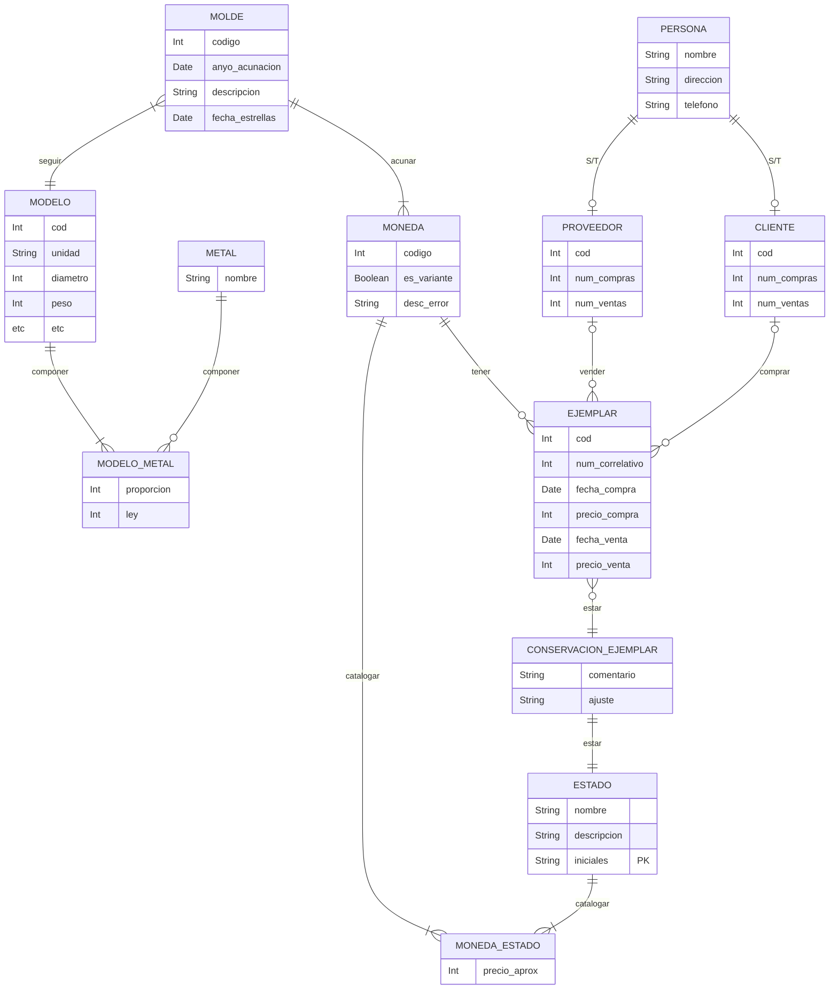

```mermaid
erDiagram
    %%%MODELO }o--|{ METAL : componer
    MODELO ||--|{ MODELO_METAL : componer
    METAL ||--o{ MODELO_METAL : componer
    MODELO_METAL{
        Int proporcion
        Int ley
    }
   

    MOLDE }|--|| MODELO: seguir
    MOLDE ||--|{ MONEDA: acunar
    %%%MONEDA }|--|{ ESTADO: catalogar
    MONEDA ||--|{ MONEDA_ESTADO: catalogar
    ESTADO ||--|{ MONEDA_ESTADO: catalogar
    MONEDA_ESTADO{
        Int precio_aprox
    }
    MONEDA{
        Int codigo
        Boolean es_variante
        String desc_error
    }
    ESTADO{
        String nombre
        String descripcion
        String iniciales PK        
    }
    MONEDA ||--o{ EJEMPLAR : tener
    PERSONA{
        String nombre
        String direccion
        String telefono
    }
    PROVEEDOR{
        Int cod
        Int num_compras
        Int num_ventas
    }
    CLIENTE{
        Int cod
        Int num_compras
        Int num_ventas
    }
    PERSONA ||--o| PROVEEDOR : "S/T"
    PERSONA ||--o| CLIENTE : "S/T"

    EJEMPLAR{
        Int cod
        Int num_correlativo
        Date fecha_compra
        Int precio_compra
        Date fecha_venta
        Int precio_venta
    }
    PROVEEDOR |o--o{ EJEMPLAR: vender
    CLIENTE |o--o{ EJEMPLAR: comprar
    EJEMPLAR}o--||CONSERVACION_EJEMPLAR :estar
    CONSERVACION_EJEMPLAR{
        String comentario
        String ajuste
    }
    CONSERVACION_EJEMPLAR ||--|| ESTADO:estar
    MODELO{
        Int cod
        String unidad
        Int diametro
        Int peso
        etc etc
    }
    MOLDE{
        Int codigo
        Date anyo_acunacion
        String descripcion
        Date fecha_estrellas
    }

    METAL{
        String nombre
    }
    
```